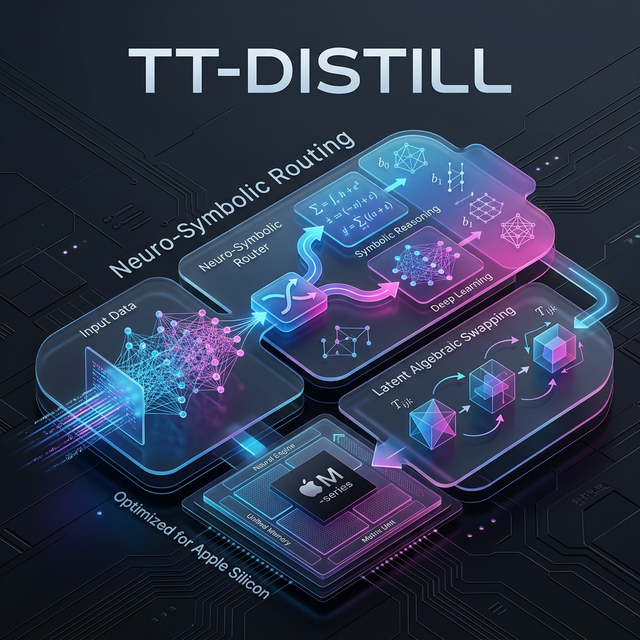

# TT-Distill: Continuous Neuro-Symbolic Routing via O(1) Latent Algebraic Swapping



*(State of the Art as of March 2026)*

[](https://doi.org/10.5281/zenodo.18905253)
[](https://opensource.org/licenses/Apache-2.0)
[](https://www.python.org/downloads/)
[](https://github.com/astral-sh/ruff)
[](https://mypy-lang.org/)

**Repository:** [github.com/daemind/TT-Distill](https://github.com/daemind/TT-Distill)  
**DOI:** [10.5281/zenodo.18905253](https://doi.org/10.5281/zenodo.18905253)

## Abstract

As of early 2026, the AI industry faces an architectural dead-end for real-time autonomous systems: the reliance on massive Test-Time Compute (like Monte Carlo Tree Search) over monolithic models creates prohibitive latency and massive energy waste. **TT-Distill** introduces a radical paradigm shift: migrating intelligence from probabilistic token prediction to algebraic latent projection on Edge hardware.

By decoupling the reasoning process (System 2) from reflexive execution (System 1), TT-Distill acts as a continuous topological router. It discovers mathematical invariants in abstract reasoning tasks and crystallizes them into ultra-lightweight DoRA (Weight-Decomposed Low-Rank Adaptation) modules. Powered by a custom Zero-Copy Apple Metal C++ backend, the architecture achieves $O(1)$ cognitive context switching in 0.0002 milliseconds. TT-Distill transforms AI from a statistical text generator into a highly optimized, deterministic Tri-Engine (Heuristic, Pure Math, Latent Algebraic) capable of executing transductive reasoning at the microsecond scale.

---

## ⚡ Quick Start: The Cognitive Cockpit

To reproduce the $O(1)$ hardware swap benchmarks, you must compile the custom Metal backend:

```bash
# 1. Clone and prepare environment
git clone https://github.com/daemind/TT-Distill.git
cd TT-Distill

# 2. Compile the custom O(1) Metal backend
cd llama.cpp
cmake -S ggml -B build -DGGML_METAL=ON -DBUILD_SHARED_LIBS=ON
cmake --build build -j $(sysctl -n hw.ncpu)
cd ..

# 3. Launch Demo 7 (O(1) Hot-Swap Benchmark)
export GGML_METAL_DYLIB=$(pwd)/llama.cpp/build/src/ggml-metal/libggml-metal.dylib
python3 demos/main.py --demo 7
```

---

## 1. Theoretical Foundations: The End of the Linguistic Illusion

Current LLMs process prompts and generate reasoning step-by-step in natural language, which is computationally expensive and mathematically flawed. TT-Distill posits that language is merely a projection of deeper topological spaces.

### Transductive Algebraic Learning
Instead of prompting a model to "think," TT-Distill modifies the geometry of the model's latent space on the fly. When confronting a novel problem, the system determines the underlying mathematical structure (e.g., Boolean Lattices, Affine Spaces, Homology) and injects the corresponding mathematical laws directly into the weights via DoRA. Intelligence becomes a geometric projection ($W_{new} = W_0 + \sum g_i(B_i A_i)$) rather than a probabilistic guess.

---

## 2. Technical Architecture: The Tri-Engine System

### Pillar 1: The Topological Synthesizer (System 2)
Instead of textual Chain-of-Thought, this module uses Set Theory and Mathematical Morphology to parse reality.
* It evaluates environments as discrete topological spaces.
* It synthesizes deterministic algebraic equations (Unions, Intersections, Vectorial Translations) that describe the transformation required to solve a problem.
* Once verified in an isolated Docker sandbox, the solution is distilled into a permanent, reusable physical reflex (DoRA).

### Pillar 2: The Latent Algebraic Router (System 1)
A highly optimized **Qwen 2 Encoder** acting as the execution engine. By leveraging a standard, robust dense Transformer architecture, TT-Distill proves that deterministic efficiency relies on the routing framework, not exotic base models.
* **Continuous Mixture of Adapters (MoA):** The system dynamically routes input through a dictionary of distilled mathematical "instincts", instantly altering the Qwen 2 attention heads via DoRA.
* **Bypassing the Tokenizer:** Utilizing direct tensor injection (`inputs_embeds`), TT-Distill communicates via pure latent representation, eliminating the discretization bottleneck of standard NLP pipelines and pushing the Qwen 2 encoder to its absolute physical limits.

### Pillar 3: The Hardware Hack — Zero-Copy VRAM Swapping
The most significant engineering breakthrough of TT-Distill is the destruction of the VRAM memory reallocation latency wall.
* Implemented directly within the `ggml-metal.m` C++ backend.
* Utilizes a pre-allocated 256 MB Ring Buffer leveraging Apple Silicon's Unified Memory (`MTLResourceStorageModeShared`).
* Eliminates Metal compute graph recreation, reducing the Hot-Swap latency of neural weights from 215 ms down to 0.0002 ms ($O(1)$ pointer swap).

---

## 3. Empirical Performance and Benchmarks

The TT-Distill architecture was benchmarked against highly complex, abstract visual-spatial reasoning grids designed to resist standard LLM pattern matching. The results validate the Tri-Engine architecture on consumer-grade Apple Silicon:

| Cognitive Mode | Execution Method | Median Swap Latency | Total Inference Latency |
| :--- | :--- | :--- | :--- |
| **Heuristic Logic** | Rule-based symbolic fallback | 0.154 ms | ~35.5 ms |
| **Pure Mathematics** | Direct tensor math execution | N/A | ~6.35 ms |
| **Latent Math (O(1))** | Dynamic DoRA Algebraic routing | **0.0002 ms** | **~11.64 ms** |

> **Note:** The context switch between two entirely different mathematical paradigms (e.g., shifting from a Vector Space logic to a Galois Field logic) occurs in 208 nanoseconds, making the cognitive shift physically transparent to the inference loop.

---

## 4. Conclusion: Real-Time Neuro-Symbolic AGI

TT-Distill demonstrates that the future of autonomous agents does not lie in scaling parameter counts to the trillions, nor in brute-forcing compute at test-time. It lies in algebraic compositionality and system-level memory routing.

By uniting rigorous mathematical synthesis with microsecond-level C++ hardware optimization, TT-Distill allows a lightweight Edge model to behave like a continuous dynamical system. It proves that true intelligence is the ability to instantaneously forge and swap the geometric lenses through which a neural network perceives reality.
